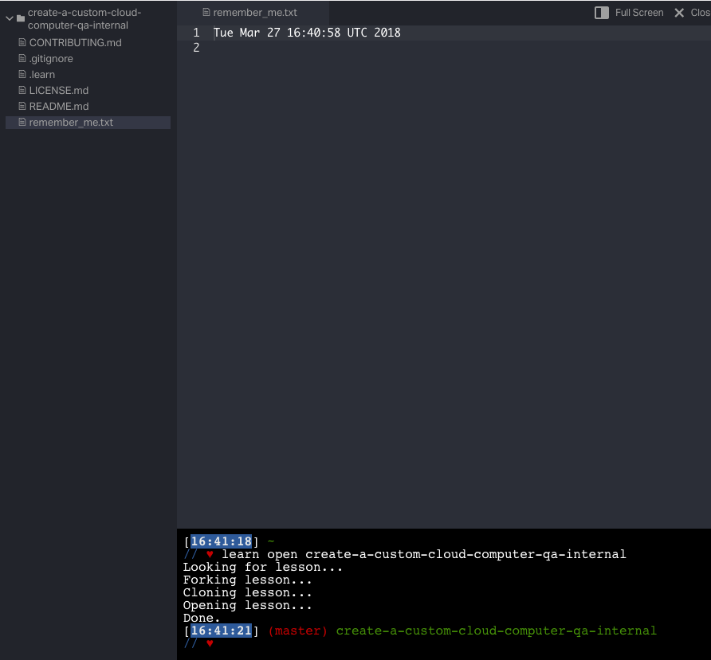
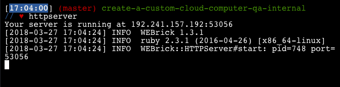
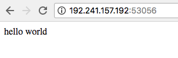
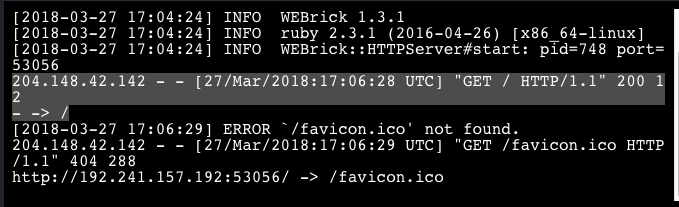

# Create a Custom Cloud Computer

In this first lab we're going to use the power of Flatiron School's
instructional environment (LearnIDE, the thing where you click on lessons and
submit labs) to create a computer in the cloud.

Why create a computer in the cloud? We do this so that your, our student,
doesn't have to worry about setting up a coding environment. By helping your
workspace "live in the cloud" we assure you that you can work from wherever you
want: home, grandma's house, a library terminal, at work during a
lunchbreak. Here's how to take advantage of this "cloud computer."

Whenever you open to this lab, and open up the learn IDE . You'll be presented with the LearnIDE (integrated development
environment). What's even more exciting is that this computer is "stateful."
That's a fancy technologist word meaning that if you close the tab suddenly or
the computer you're using catches fire or all the wifi in your city goes down,
**the information on your cloud computer is completely safe!**

## Experiencing Your Custom Cloud Computer's "Statefulness"

Open up the IDE for this lesson.

In the Learn Terminal type:

`$ date > remember_me.txt`

This will put the current date and time into a file called `remember_me.txt`
You can select this file from the "File explorer" at left and see that your
file contains the date, time, timezone and year. It should look something like:
`Tue Mar 27 16:40:58 UTC 2018`.

Now. Close this tab! Close learn! Close everything! If you're feeling
particularly daring feel free to reboot your local machine (although that's not
necessary!) You can restore a closed tab by using (⌘ + Shift + T).

Do it!

You're back! Glad to see you. Re-open the lab with the "Open IDE" button.  Take
a look at your `remember_me.txt` file and you'll see that it has the date and
time from your last session. This means that you can use this computer as a
private web development environment.  We think it's very cool and hope you will
too.

## Basic Web Server

Your Custom Cloud Computer also ships with a web server. Typically to see what
a website under development looks like you have to "deploy" the site to a
remote server with a real internet address. We'll learn more about that later
in this class, but we've included a basic web server on your Custom Cloud
Computer.

This lab ships with a basic `index.html` file &mdash; you're going to be
creating a lot more of these files and will overwrite this basic file many,
many times in this class &mdash; so don't get too attached! When you start the
basic web server, the server will look for this `index.html` file by default
and "serve" it.

Activate the server by typing `httpserver`. It should look like this

The `httpserver` will tell you how to access your Custom Cloud Computer's
webserver by offering you an address and a port.

In this example the address is `192.241.157.192` and the port is `53056`. This
server is available on the internet at `192.241.157.192` and this server is
listening at port `53056`. We don't need to understand the finer points of
addresses and ports yet save to know that we need to provide the full address
and port specification to our browser.

Provide this address and port combination to your browser. it should look like
this:

If you look in the Learn terminal you can see that we logged to the screen a
"hit" or a "web site request."

Amazing! This line means that some computer at 204.148.42.142 at a certain
datestamp said `GET` me whatever's at `/` and the server responded `200` which
means "OK!"

To stop the web server type "CTRL + C." If you try to refresh the same page
you'll no longer get anythihng back because, well, you stopped the server.

## Conclusion

While you'll work through many labs and READMEs in this course, you can always
return to this lab and pick up where you left off. You can use this as a
staging computer for your "Portfolio Projects" or for a personal website about
yourself. We don't know where your creativity will lead you, but we're excited
to see what you do!
